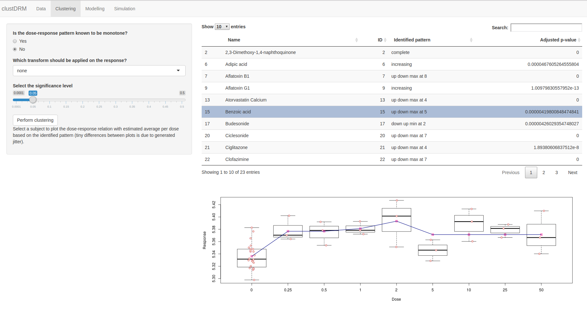
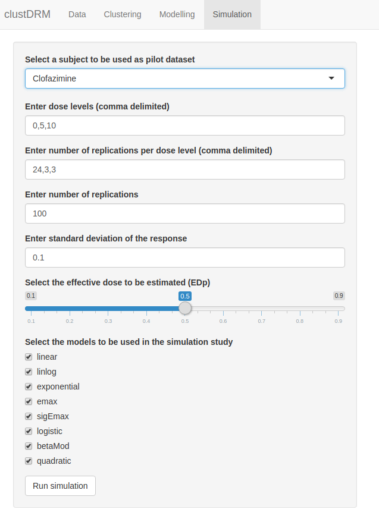

---
---

<link rel="stylesheet" href="styles.css" type="text/css">

In order to make the use of different functionalities of `clustDRM` package
easier, an R-Shiny app is developed. The app can be lauched using the following
command:

```{r, eval = FALSE}
clustDRMapp()
```

The Shiny app has 4 main tabs corresponding to the main functionalities of
`clustDRM`: Data, Clustering, Modelling, and Simulation. 

## Data tab

The Data tab can be used to upload the dataset. It should be a `.csv` file in a
correct format. The following figure shows the first view after running
the Shiny app.

```{r shinyEntry, echo = FALSE , fig.cap  = "First view of the Shiny app after running.", fig.width = 12, warnings = FALSE, error = FALSE, message = 'hide'}
knitr::include_graphics("imgs/shinyFirst.png")
```
After uploading a `.csv` data file via the Data tab, one needs to select the
columns in the data corresponding to the name of the variables, also ID, dose,
and response, as well as the added covariates (if any). After uploading the
data, a table will show the dataset. By clicking on each row of this table the
corresponding dose-response data will be plotted. Note that a jitter boxplot is
used here, so plotting the same compound another time would produce slightly
different results. The following figure shows an example of using Data
tab.

```{r shinyData, echo = FALSE , fig.cap  = "Data tab of the Shiny app.", fig.width = 12, warnings = FALSE, error = FALSE, message = 'hide'}
knitr::include_graphics("imgs/shinyData.png")
```

## Clustering tab

Once the data are uploaded, and dose and response columns are identified, one
can proceed to clustering tab. Three components should be specified in this tab.
First: whether the response is known to be monotone or not, second: the type of
transform to be applied on the response, and finally, third: the level of
significance. 

By clicking the Perform clustering button, the clustering will be performed. It
might take several minutes depedning on the size of the dataset. In case of
general pattern clustring, the computations will be done in parallel using one
less than the number of available cores. 

Upon finishing the clustering, a table will be diaplyed on the screen with the
clustering results. By clicking on each row of this table the dose-response data
will be plotted using jitter boxplots with displayed means estimated based on
the identified patterns. The following figure shows the use of this
tab.


```{r shinyClustering, echo = FALSE , fig.cap  = "Clustering tab of the Shiny app.", fig.width = 12, warnings = FALSE, error = FALSE, message = 'hide'}

```

Note that, some arguments are pre-specified in the Shiny app while using the
functions available via the `clustDRM` package they can be customized. For the
Shiny app, in case of monotone compounds, only `E2` test is performed. For the
general patterns we use `ORICC2` followed by only `MCT`, and
`theLeastNumberOfMethods = 2`, i.e., the non-flat identified patterns should be
approved by MCT as well.

## Modelling tab

Having the clustering results, one can move on to the Modelling tab. It requires
the $p$ in EDp to be selected (delfault is 0.5, i.e., ED50), as an optional
feature, one can give the toxic dose threshold. If the EDp is estimated smaller
than this threshold, then the compound is considered as toxic. Clicking on
Estimate EDp button will begin the modelling task. Here also, one minus the
number of available cores will be used to perform computations.

Once it is over, a table with estimated EDp will be displayed on the screen. If
a threshold is specified, then an extra column will show if each compound is
toxic or not. Again, by clicking on each row of the table a jitter box-plot of
dose-response data will be displayed with a vertical line indicating the
estimated EDp. The following figure shows an example of the use of
this tab.

```{r shinyModelling, echo = FALSE , fig.cap  = "Modelling tab of the Shiny app.", fig.width = 12, warnings = FALSE, error = FALSE, message = 'hide'}
knitr::include_graphics("imgs/shinyModelling.png")
```

## Simulation tab

The Simulation tab can be used to perform the described simulation study. For
that, one needs to first select one of the compounds in the uploaded dataset as
the pilot data, then the dose levels and number of replications per dose should
be entered. This can be done using comma delimited text. For example, if one is
interested to have dose 0 mg with 10 replications, 10 mg with 5 replications,
and 25 mg with 5 replications, then these should be entered as `0, 10, 25` for
dose-levels and `10, 5, 5` for number of replications. 

Furthermore, the number of replications of the simulation study, the standard
deviation of the generated response, the desired EDp, and the models which
should be used in the simulation study are needed to be specified. he following
figure shows an example of specifying different arguments for simulation.

```{r shinySim1, echo = FALSE , fig.cap  = "Specifying different arguments in the Simulation tab of the Shiny app.", fig.width = 12, warnings = FALSE, error = FALSE, message = 'hide'}

```

Once all arguments are correctly specified, clicking on Run simulation button
will begin the simulation task. As one can see in the following figure,
once the simulation task is complete, one can select a measure to produce the
heatmap which summarizes the simulation results.


```{r shinySim2, echo = FALSE , fig.cap  = "Summaryzing the results in the Simulation tab of the Shiny app.", fig.width = 12, warnings = FALSE, error = FALSE, message = 'hide'}
knitr::include_graphics("imgs/shinySim2.png")
```
